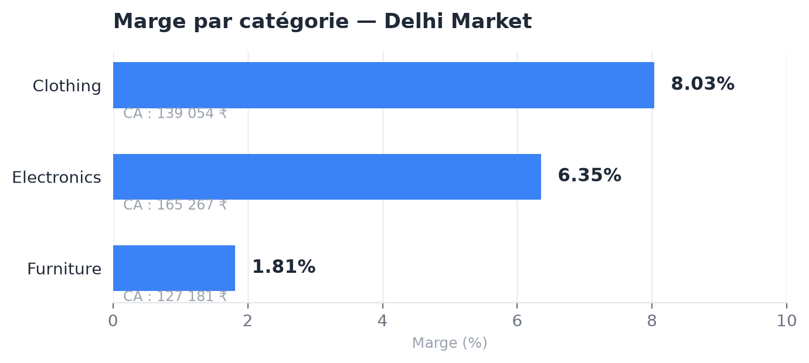

# Delhi Market — Analyse SQL de la rentabilité d'une marketplace e-commerce

Analyse SQL/BigQuery de 500 commandes et 1 500 lignes produit : la catégorie qui vend le plus (Electronics) n'est pas la plus rentable, et une sous-catégorie entière fait perdre de l'argent à chaque vente.

## Contexte

Marketplace e-commerce basée à Delhi, vendant sur 3 grandes catégories (Electronics, Clothing, Furniture). La direction veut comprendre la saisonnalité des ventes, la rentabilité réelle par catégorie/sous-catégorie, et si les objectifs mensuels de vente sont tenus.

Données : commandes (`list_of_orders`), lignes de commande avec montant et profit (`order_details`), objectifs mensuels par catégorie (`sales_target`).

## Démarche

**Saisonnalité et panier moyen** — jointure `list_of_orders` / `order_details` sur `Order ID`, CA agrégé par année/mois (`GROUP BY`). Panier moyen calculé via une CTE qui reconstitue d'abord le montant total par commande, puis moyenne ce montant par mois.

**Rentabilité par catégorie et sous-catégorie** — `GROUP BY` catégorie/sous-catégorie avec `SUM(amount)` et `SUM(profit)`, pour distinguer volume de vente et profit réel (une catégorie peut vendre beaucoup et rapporter peu).

**Sous-catégories déficitaires** — `GROUP BY` + `HAVING total_profit < 0` pour isoler directement les sous-catégories qui font perdre de l'argent, sans les chercher manuellement dans la liste.

**Suivi des objectifs** — jointure à 3 tables (commandes, détails, objectifs) sur catégorie/mois/année, puis classification par `CASE WHEN` avec une tolérance de ±3 % autour de la cible (`on_target` / `above_target` / `below_target`) plutôt qu'un simple seuil binaire.

**Bonus classement** — fonction fenêtrée `RANK() OVER (ORDER BY total_sales DESC)` pour classer les commandes par montant, et `CASE WHEN` pour segmenter les catégories en High/Medium/Low-value selon leur CA.

## Résultats

- **CA total 431 502 ₹, profit total 23 955 ₹ → marge globale de 5,55 %.**
- **Electronics génère le plus de CA (165 267 ₹) mais Clothing est la catégorie la plus rentable** (marge 8,03 % contre 6,35 % pour Electronics) — le volume de vente ne dit pas tout sur la rentabilité.
- **Clothing rate son objectif de vente 9 mois sur 12**, alors même que c'est la catégorie la plus rentable : un problème de volume/acquisition, pas de marge.
- **La sous-catégorie Tables fait perdre de l'argent sur chaque vente** (marge de -17,7 %), tout comme Electronic Games (-3,2 %) — c'est ce qui tire Furniture vers la marge la plus faible des 3 catégories (1,8 %).
- À l'inverse, T-shirt (20,3 %) et Accessories (16,4 %) sont les sous-catégories les plus rentables du catalogue.

## Recommandations

- Revoir la politique de prix ou de fournisseur sur **Tables** en priorité (perte nette, pas juste une faible marge) et surveiller Electronic Games.
- Sur **Clothing** : chercher le levier volume (marketing, assortiment, disponibilité) plutôt que le prix — la rentabilité est déjà là, c'est la demande qui manque.
- Répliquer ce qui marche sur les sous-catégories textiles à forte marge (T-shirt, Accessories) vers le reste du catalogue Clothing.

## Outils

BigQuery Standard SQL · JOIN · CTE · GROUP BY / HAVING · CASE WHEN · fonction fenêtrée RANK()

---
*Projet réalisé dans le cadre de la formation Data Analyst DataBird.*
